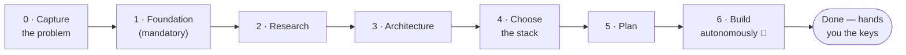

<div align="center">

# Genesis

**Autonomous project builder for [Claude Code](https://claude.com/claude-code).**
Describe the app you want in plain English. Genesis researches it, designs it, then builds, tests, and
security-audits it on your machine — autonomously, until it's done.

[](LICENSE)
[](https://code.claude.com/docs/en/discover-plugins)
[](#status)

**[Install](#install) · [Quick start](#quick-start) · [How it works](#how-it-works) · [FAQ](#faq)**

Example: **[brandcrafter.app](https://brandcrafter.app)** — a production SaaS genesis built from an empty folder.

</div>

---

## What it is

Genesis is a Claude Code **plugin** for starting **new** projects. Instead of jumping straight to code, it
lays a foundation first (coding standards, docs, tests, a security sandbox), researches and designs the
solution, and only then picks a stack — all logged with rationale. Then a lead agent — the **overlord** —
dispatches specialist agents to build, test, review, and security-audit the project item by item, without
stopping to ask, until the acceptance criteria are actually observed passing.

It runs entirely on your machine, on your Claude subscription. It is **greenfield-only**: it creates projects
from an empty folder and is not a tool for changing existing codebases.

## Requirements

**Required:**

- **[Claude Code](https://claude.com/claude-code)** (terminal, VS Code, or desktop app) with a paid Claude plan.
- **[Node.js](https://nodejs.org) 18+** — only if you use the optional dashboard or usage-based auto-resume.

**Recommended:**

- **Claude Max** — a full autonomous build is long and usage-hungry; Max gives it room to finish in fewer
  pauses. Works on Pro, just with more waiting.
- **Auto mode** — let Claude Code run without approving every action; that's what makes an unattended build
  actually unattended. Genesis pairs it with the sandbox it sets up, but you enable it at your own risk — we
  are not responsible for issues caused by running with reduced permission prompts.
- **`ultracode`** — strongly recommended, not required. Include the keyword in the prompt that kicks off a
  build: it opts Claude Code into multi-agent orchestration, and the build loop gets noticeably more thorough.

**Platforms:** macOS gets the extra OS-level sandbox layer and the optional overnight auto-resumer. On Windows
and Linux, genesis still enforces the write-scope and secret-read rules through Claude Code permission rules;
everything else is cross-platform.

## Install

Two steps everywhere: **1)** register this repo as a plugin source, **2)** install the plugin from it. Pick
the way that matches how you use Claude Code:

**Terminal / VS Code / desktop app — at the Claude prompt** (not your shell), one command at a time:

```text
/plugin marketplace add gabrieldabbah/genesis
```

```text
/plugin install genesis@genesis-marketplace
```

**Through the `/plugin` menu** (any surface): type `/plugin`, add a marketplace and enter
`gabrieldabbah/genesis` as the source, then install **genesis** from the plugin list.

**From your shell** (scriptable — e.g. for dotfiles or machine setup):

```bash
claude plugin marketplace add gabrieldabbah/genesis
claude plugin install genesis@genesis-marketplace
```

> Note the two different formats: *marketplace add* takes a **source** (`owner/repo`, a URL, or a path);
> *install* takes an **address** (`plugin@marketplace` — here, plugin `genesis` from the marketplace named
> `genesis-marketplace`). Don't paste the `@` form into "add marketplace" — it will be rejected.

To confirm it worked, type `/genesis` — it should appear in the command list. Installed once, genesis is
available in every project on that machine.

## Quick start

**1.** Create an empty folder and open Claude Code in it.

In a terminal:

```bash
mkdir my-app && cd my-app && claude
```

In VS Code or the desktop app: create a new empty folder, open it (*File → Open Folder*), then open the
Claude Code panel.

**2.** Start genesis:

```text
/genesis
```

**3.** Answer a short plain-English interview (what you're building, who it's for, how cautious to be).
Then genesis runs on its own: it decides what it can (and logs *why* in a generated `docs/DECISIONS.md`), and
defers only the things that genuinely need you — creating accounts, pasting API keys, the production deploy —
to a documented handoff at the end.

**4.** Long builds can hit your Claude usage limit; genesis checkpoints itself and pauses instead of dying.
Once the limit resets, open Claude Code in the same project folder again (`cd my-app && claude`) and type
`resume genesis` — it continues exactly where it stopped. When it finishes, it summarizes what it built, with
evidence, and waits.

Want a visual view? Type `/genesis-dashboard` in the same session to open a local web dashboard in your
browser — live progress, TODO status, one-click service connections — while the session keeps running
underneath ([details](dashboard/README.md)).

## How it works

The core idea is **order**. Genesis never starts with "which framework?" — the stack is chosen in phase 4,
*after* the problem is understood and the architecture is designed:



| Phase | What happens |
|------:|--------------|
| **0** | Your goal is captured in plain English |
| **1** | **Foundation** — coding standards, agent manual, docs skeleton, hardened sandbox. Non-skippable |
| **2** | Research the domain and candidate approaches, with sourced claims |
| **3** | Design the architecture and write it down |
| **4** | Choose the stack, derived from the design, rationale logged to `docs/DECISIONS.md` |
| **5** | Produce a dependency-ordered TODO with acceptance criteria |
| **6** | Build loop: implement → test → security-audit → review → integrate, one item at a time |

During phase 6, the **overlord** — a lead agent on the strongest available model — orchestrates specialists:
`builder`, `tester`, `reviewer`, `secaudit`, plus per-project workers like `deploy` or `payments`. The
overlord has no file-editing tools, so it can't cut corners by coding itself; and a lifecycle hook (Claude
Code's Stop hook) refuses to let a run declare itself finished until the acceptance criteria are *observed*
green, not assumed.

## Safety model

Two layers, deliberately separated so security never blocks normal work:

- **Filesystem + secrets (always on):** writes only inside the project; reading secret paths (`~/.ssh`,
  `~/.aws`, `.env`, tokens) is blocked at both the shell and file-read layers; commits, pushes, and deploys
  always require you. Genesis *verifies* these blocks by behavior on every run rather than trusting config.
- **Network (you choose):** `open` by default (research and browser work stay unrestricted), or an
  `allow-list` for money/PII projects.

## Nice to have around it

- **Seeds** — after your first run, say *"save this as a seed"* and genesis writes your preferences (stack
  tastes, sandbox posture, integrations) to a reusable file. Next project: `/genesis use <name>` skips the
  interview. See [`seeds/`](seeds/).
- **Integrations registry** — each supported service (Stripe, Supabase, Vercel, Fly.io, Render, Clerk, Resend,
  Cloudflare R2, Sentry, OpenAI, Google Gemini) is one YAML file that wires its domains, key names, CLI, docs,
  security checklist, and a specialist worker. Add a service by adding a file: [`integrations/`](integrations/).
- **Usage-limit survival** — genesis watches your 5-hour usage window and checkpoints *before* the cap so
  nothing dies mid-task; `resume genesis` picks up exactly where it stopped. An optional launchd/cron job can
  do the resuming overnight.
- **Skills-only install** — `npx skills add gabrieldabbah/genesis` (via [skills.sh](https://skills.sh)) installs
  genesis's individual skills into Cursor, Codex, and 70+ other agents. Note that the autonomous system itself —
  the agents, the Stop gate, `/genesis` — comes only with the plugin install above.

## What's inside

| Path | Role |
|---|---|
| [`skills/genesis`](skills/genesis/) | the orchestrator: interview → foundation → research → design → stack → plan → build |
| [`skills/`](skills/) | the constitution (`axiomatic-induction` — the reasoning rules every agent follows) + working skills: `design`, `todo`, `test-gate`, `sources`, `security-audit`, `generate-pr`, `media-gen`, `usage-guard`, `genesis-seed`, `genesis-dashboard` |
| [`agents/`](agents/) | the overlord + specialist workers |
| [`hooks/`](hooks/) | the acceptance Stop gate |
| [`integrations/`](integrations/) | the service registry (one YAML per service — extensible) |
| [`dashboard/`](dashboard/) | the optional local dashboard (zero-dependency Node server + PWA) |
| [`templates/`](templates/) | scaffolding: agent manual, docs skeleton, env files, PR template |
| [`seeds/`](seeds/) | reusable configuration presets |

## FAQ

<details>
<summary><b>Does it cost extra beyond my Claude subscription?</b></summary>

No — genesis runs entirely on your Claude Code subscription. Only optional third-party media generation
(OpenAI, Google, …) uses those providers' own API keys and billing, and only if you enable it.
</details>

<details>
<summary><b>Will it commit, deploy, or create accounts without asking?</b></summary>

No. Those need your explicit go-ahead. Genesis builds everything around them in test/sandbox mode, writes the
exact remaining steps to `docs/DEPLOYMENT.md`, and hands them to you at the end — it doesn't stop mid-build to ask.
</details>

<details>
<summary><b>Can it read my secrets or write outside the project?</b></summary>

The sandbox blocks both, and genesis verifies the blocks by behavior (it confirms an out-of-project write and a
secret read actually fail) on every run. See [Safety model](#safety-model).
</details>

<details>
<summary><b>Does it work in the VS Code extension?</b></summary>

Yes, fully — including pause/resume. The only terminal-specific piece is the optional overnight auto-resumer.
</details>

<details>
<summary><b>Can I point it at an existing codebase?</b></summary>

No — greenfield-only by design. It creates projects from an empty folder; refactoring or migrating existing
code is out of scope.
</details>

## Status

**Alpha.** Genesis is new and evolving. Two Claude Code internals it depends on can change between versions —
the exact sandbox setting names, and the output of [`ccusage`](https://github.com/ryoppippi/ccusage) (the CLI
it uses to read your usage) — and genesis detects and adapts to both on first run. Try it on throwaway
projects first, and review what it generates.

## Contributing

Issues and PRs welcome. The highest-value contribution is a **new integration**: add a
`integrations/registry/<id>.yaml` (plus an optional specialist worker) following
[`integrations/README.md`](integrations/README.md). Keep everything English-first and free of personal names,
machine-specific paths, and secrets.

## License

[MIT](LICENSE)
