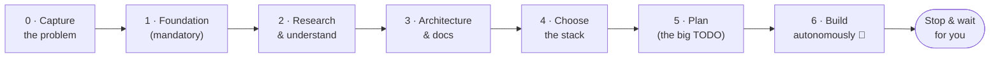

<div align="center">

# ⚡ Genesis

### Empty folder → a working, tested, secured app. One prompt, built autonomously on your machine.

Genesis is a [Claude Code](https://claude.com/claude-code) **plugin**. Tell it what you want in plain English;
an **Opus "overlord"** lays a solid foundation, **researches and designs before writing code**, picks a stack,
then dispatches specialist agents to build, test, and security-audit your project one item at a time —
checkpointing around your usage limits and continuing after they reset, until it can't improve further without you.

[](#license)

[](https://skills.sh/gabrieldabbah/genesis)


</div>

---

> [!NOTE]
> **Greenfield only.** Genesis *creates* projects from nothing. It is not a refactor/migration tool — pointing
> it at an existing codebase is out of scope by design.

## Why genesis

Starting a project well is mostly *foundation* work that's easy to skip: a constitution and conventions, an
agent manual, a sandbox so an AI can't wander or leak secrets, docs, a test harness, a sane plan. Skip it and an
AI agent happily jumps to "what framework?" and starts coding the wrong thing.

Genesis refuses to do that. It lays the **mandatory foundation first**, **researches and designs before it
writes code**, and only **then** picks a stack — all inside a sandbox you control. Then it *keeps going on its
own*, reviewing every change against your standards, until the work is genuinely done.

Think "[Lovable](https://lovable.dev)/bolt-style autonomy, but running on your machine in Claude Code" — with a
real sandbox, your own coding standards, and an optional dashboard instead of a hosted website.

## When to use it (and when not)

| Use genesis when… | Reach for something else when… |
|---|---|
| Starting a **new** project from an empty folder | You have an existing codebase to change (genesis is greenfield-only) |
| You want it to **research, plan, and build autonomously** | You want a single quick edit or a one-off script |
| You care about **standards, tests, and security** from line one | You're prototyping throwaway code and don't want guardrails |
| You want a **repeatable** project setup (via seeds) | — |

## How it works — the order of operations

The whole point is the **order**. Genesis never starts with "what stack?" — that's decided in Phase 4, *after*
it understands the problem.



| Phase | What happens | Stack decided? |
|------:|--------------|:--------------:|
| **0** | Capture the problem + prime directive in plain English | ❌ (a stack mention is just a hint) |
| **1** | **Foundation** — constitution, skills, `AGENTS.md` (+ `CLAUDE.md`), docs skeleton, **hardened sandbox** | ❌ stack-agnostic |
| **2** | Research the domain with trusted sources + the web | ❌ candidate stacks researched only |
| **3** | Design the architecture; write the docs | ❌ |
| **4** | **Choose the stack** — derived from the architecture, rationale **logged to `DECISIONS.md`** | ✅ here |
| **5** | Produce a dependency-ordered TODO with acceptance criteria; refine & re-sort | |
| **6** | The overlord loops: build → test → security → review → integrate, **self-verifying**, until done | |

> [!IMPORTANT]
> Phase 1 is **non-skippable**. Every genesis repo gets the same solid foundation before any code is written.

## Quick start

**1. Install the plugin (once, global):**

```bash
/plugin marketplace add gabrieldabbah/genesis
/plugin install genesis@genesis-marketplace
```

> [!TIP]
> **Skills-only install (any agent):** `npx skills add gabrieldabbah/genesis` installs genesis's *skills*
> (test-gate, sources, todo, design, …) into Claude Code, Cursor, Codex, and 70+ other agents via
> [skills.sh](https://skills.sh). That gives you the individual disciplines — but **not** the genesis system:
> the overlord/worker **agents**, the acceptance **Stop-gate hook**, and the `/genesis` orchestration only
> come with the full plugin install above.

**2. Open an empty folder and start:**

```bash
mkdir my-app && cd my-app && claude
```
```text
/genesis
```

**3. Answer a few plain-English questions** up front. After that, genesis runs **0 → 100% without stopping to
ask** — it decides what it can (and logs why in `DECISIONS.md`), and defers only the things that need *your*
accounts or credentials (creating a Stripe account, the production deploy) to a documented handoff at the end.
When it's done, it summarizes with evidence and waits.

> If a run pauses at your usage limit, just type **`resume genesis`** once your limit resets — it continues from
> the checkpoint. (More below.) Prefer a UI? Run [`/genesis-dashboard`](#the-dashboard-optional).

## Recommended skills

Genesis runs on its own, but it's noticeably better paired with a few skills. Two ship **with genesis**; the
rest are **third-party** — genesis references them in the `AGENTS.md` it generates and *you* install them (it
never installs external skills for you).

**Bundled with genesis** — already there once the plugin is installed:

- **`axiomatic-induction`** — the constitution *and* the reasoning method genesis applies to every decision
  (derive from axioms, verify by observation, degrade safely). Auto-applied; you never invoke it directly.
- **`generate-pr`** — turns a branch diff into a complete, evidence-grounded pull request (`/generate-pr`),
  filling the PR template genesis writes into every repo.

**Third-party — install yourself** (genesis just points you to them):

- **`git-commit`** — Conventional-Commit messages with the right trailer, from the **awesome-copilot**
  collection. Find and install via the [skills.sh](https://skills.sh) CLI: `npx skills find git-commit`,
  then `npx skills add <owner/repo>` of the result you pick.
- **`impeccable`** — a high-craft frontend/design skill set; pair it with genesis's bundled **`design`** skill
  for genuinely top-tier UI. Install with its own CLI: `npx impeccable skills install`.

> The generated `AGENTS.md` lists these with a "when to invoke which" table — alongside genesis's bundled
> working skills (`sources`, `test-gate`, `todo`, `design`) and any third-party sets you add. Installing an
> external skill is always a step **you** run.

## Seeds — save a setup, reuse it anywhere

A **seed** is a named, reusable configuration that **genesis writes for you** from a conversation — you never
hand-author config files. It captures your archetype, stack, integrations, sandbox posture, autonomy
preferences, and providers as readable English (with a small machine-readable header).

```text
1. /genesis                     # first project — answer the interview
2. "save this as a seed"        # genesis writes seeds/<name>.md (or a private one, untracked)
3. cd ../next-app && claude
4. /genesis use <name>          # loads the seed and asks ONLY what's new (name, repo, deltas)
```

Keep several — a `saas` seed, a `cli` seed, a per-client seed — i.e. **different genesis "presets."** Public,
shareable seeds live in [`seeds/`](seeds/) (see [`seeds/oss-default.md`](seeds/oss-default.md) for the shape);
private, machine-specific ones stay untracked in `seeds/private/`. Manage them with the
[`genesis-seed`](skills/genesis-seed/SKILL.md) skill (`save`, `list`, `show`).

## The dashboard (optional)

A local **PWA** for setting up and watching a build *outside* the terminal — for less-technical users, or when
you just want to see progress at a glance. Advanced users can ignore it entirely.

```bash
node "$CLAUDE_PLUGIN_ROOT/dashboard/server.mjs"   # or: ask Claude "open the genesis dashboard"
```

It opens on `127.0.0.1` (token-gated, nothing exposed to the network) and shows the **stage timeline**, the
**TODO** with build/test status, a **live activity** feed, a **usage meter**, and **integration cards**. Click
**Connect** on a service, paste the key (written to `.env` on your machine only, never logged), and the AI
wires the code. It talks to genesis through two files — a state file it reads and an intent inbox it writes — so
there's no coupling into Claude Code. Details: [`dashboard/README.md`](dashboard/README.md).

```text
 ⚡ Genesis · my-app                              [▓▓▓▓▓░░ 62%]  [Pause]  ●
 ┌── Stage ─────────────────────────────────────────────────────────────┐
 │  ✓ Capture  ✓ Foundation  ✓ Research  ✓ Architecture  ● Choose stack  │
 │  Decided: TypeScript + Hono + Vitest (rationale → DECISIONS.md)        │
 ├── TODO ──────────────────────────────────────────────────  2/9 done ──┤
 │  [build✓][test✓] Project skeleton + CI                                 │
 │  [build●][test·] Auth middleware                                       │
 ├── Integrations ──────────────────────────────────────────────────────┤
 │  Stripe  · needs key  [Connect]      Supabase  ✓ connected [Reconnect] │
 └───────────────────────────────────────────────────────────────────────┘
```

## Security model — encapsulation without friction

Genesis separates the two halves of "encapsulation" so security never gets in the way of, say, a web-research
or browser-automation project:

| Dial | Default | What it does |
|---|---|---|
| **Filesystem + secrets** *(always on)* | strict | Writes only inside your project scope; **blocks reading secrets** (`~/.ssh`, `~/.aws`, `.env`, tokens) at **both** the Bash and Read-tool layers; no commit/push/deploy without asking |
| **Network** *(you choose)* | **open** | `open` for research/browser/AI/general dev (outbound free; files + secrets still locked) · `allow-list` for money/PII apps · `hybrid` in between |

> [!TIP]
> The strong protection is the filesystem + secret layer — that's always on. The network is a *posture* you pick
> per project, defaulting to **open** so research and browser work aren't crippled.

Genesis writes the sandbox config and then **verifies it by behavior** (it confirms an out-of-folder write and a
secret read are actually blocked). You never edit settings or run `/sandbox`.

## Integrations

Each third-party service is **one file** in [`integrations/registry/`](integrations/registry/). Selecting a
service automatically wires its **domains** (into the network allow-list), its **secret key names** (into
`.env.example` + the deny rules), its **CLI** (into the sandbox exclusions), its **docs** (into your trusted
sources), a matching **specialist worker**, its **security checklist**, and a **verification task**.

Shipped today (extensible — add a service by dropping a YAML file):

`Stripe` · `Supabase` · `Vercel` · `Fly.io` · `Render` · `Clerk` · `Resend` · `Cloudflare R2` · `Sentry` ·
`OpenAI` · `Google Gemini`

## The agent model

A meticulous lead + scoped specialists — a hub and spokes:

- **`overlord`** *(Opus)* — plans, dispatches, **reviews every detail** against your standards, integrates. It
  has **no Edit/Write** tools, so it can't cut corners by coding itself.
- **`builder` / `reviewer` / `secaudit`** *(Opus — the best model for code)* — implement test-first, audit
  quality, run the security pass. **`tester`** *(inherits the run's model)* runs the test gate. Report-only
  agents can't edit.
- **Specialists** *(generated per project)* — `deploy`, `payments`, `data-migration`, `docs-writer`, `design`,
  `a11y` — pulled in only when the work needs them.

A **Stop hook** refuses to let a run "finish" until acceptance criteria are **observed green**, not assumed.

## Long runs survive your usage limits

A full build can outlast a single 5-hour usage window — so genesis is built to pause and continue cleanly:

- It watches usage (via `ccusage`) and, **before** the cap (default 85%), **checkpoints and halts** so in-flight
  subagents are never killed mid-work.
- When your window resets, **type `resume genesis`** — it reads the checkpoint and picks up at the exact item it
  stopped on. One line; works the same in the VS Code extension and the terminal.
- *Optional, terminal-only:* to have it resume itself overnight while you're away, install a one-time macOS
  **launchd** (or cron) job that types that for you. Handy for unattended runs; most people never need it.

The in-session pause/checkpoint needs zero setup — only the hands-off overnight resumer needs the one-time job.

## What's inside

| Path | Role |
|---|---|
| [`skills/genesis`](skills/genesis/) | the orchestrator: interview → foundation → research → design → stack → plan → build |
| [`skills/genesis-seed`](skills/genesis-seed/) | save / load reusable seeds + one-time machine setup |
| [`skills/genesis-dashboard`](skills/genesis-dashboard/) | launch the optional PWA dashboard |
| `skills/{axiomatic-induction,design,todo,test-gate,sources,generate-pr}` | the constitution + the working skills (incl. UI/UX craft) |
| `skills/{media-gen,security-audit,usage-guard}` | media/AI generation · the security pass · usage auto-resume |
| [`agents/`](agents/) | `overlord` (Opus) + workers — best model for code/UI/UX, `inherit` for run-and-report |
| [`hooks/`](hooks/) | the acceptance Stop gate |
| [`integrations/`](integrations/) | the service registry — extensible |
| [`dashboard/`](dashboard/) | the optional local PWA (zero-dependency server + frontend) |
| [`templates/`](templates/) | `AGENTS.md`, docs skeleton, `.env` family, PR template |
| [`seeds/`](seeds/) | `oss-default` (worked example); your private seeds stay untracked |

## Requirements

- **Claude Code** with a Pro/Max subscription (genesis stays on your subscription; image/video generation uses
  *other* providers' API keys, kept in `.env`).
- **macOS** for the OS-level sandbox and the launchd auto-resume (the rest is cross-platform).
- **Node.js** — only if you use the dashboard or `ccusage`-based auto-resume.
- **rtk** *(optional)* — if present, genesis routes commands through it for token savings; if absent, it falls
  back to plain commands. Never required.

## FAQ

<details>
<summary><b>Does it work in the VS Code extension? How do I resume after a pause?</b></summary>

Yes — fully, the same as the terminal. If a run pauses at your usage limit, it saves a checkpoint and stops.
When your limit resets, type **`resume genesis`** and it continues exactly where it left off — one line, no
flags, no terminal gymnastics. (The optional overnight auto-resumer is the only terminal-specific piece, and
most people don't need it.)
</details>

<details>
<summary><b>Does this use the API and cost extra?</b></summary>

No — genesis runs on your Claude Code subscription. Only third-party media/AI generation (OpenAI, Google, …)
uses those providers' own API keys and billing, and only if you enable them.
</details>

<details>
<summary><b>Will it commit or deploy without asking?</b></summary>

No — and it won't pester you mid-run either. Commits, pushes, deploys, account creation, and live keys are
things only you can authorize: genesis builds everything *around* them (in test/sandbox mode), collects the
exact steps into `docs/DEPLOYMENT.md`, and hands them to you to run at the end. It doesn't stop the build to ask.
</details>

<details>
<summary><b>Can it leak my secrets or write outside the project?</b></summary>

The sandbox blocks reading secret paths (both the Bash and Read-tool layers) and writing outside your chosen
scope, and genesis verifies this by behavior on every run. The network can additionally be locked to an
allow-list for sensitive projects.
</details>

<details>
<summary><b>Do I have to use the dashboard?</b></summary>

No. It's optional and aimed at less-technical users. The full flow works from the terminal.
</details>

## Status & roadmap

> [!WARNING]
> **Alpha.** Genesis is new and evolving. Two things are version-sensitive and self-correct on first run: the
> exact sandbox setting names (genesis verifies behaviorally and adjusts) and the `ccusage` output format (read
> defensively). Try it on throwaway projects first and review what it generates.

Planned: more integrations, a richer specialist library, and a hosted-mode option.

## Contributing

Issues and PRs welcome. The cleanest contribution is a **new integration**: drop a `registry/<id>.yaml` (+ an
optional `agents/_library/<worker>.md`) following [`integrations/README.md`](integrations/README.md). Keep
everything English-first and free of personal names, machine paths, and secrets.

## License

[MIT](LICENSE).
