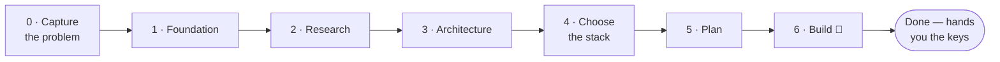

<div align="center">

# Genesis

**Describe what you want. Get a real codebase — researched, designed, built, tested, and secured.**

Genesis turns an empty folder into a working SaaS, web app, API, or CLI, running autonomously on your machine
in [Claude Code](https://claude.com/claude-code). It can also take a codebase you already have and bring it up
to the same standard.

Built for frontier models and agentic engineering — not a template pack.

[](#upgrading)
[](LICENSE)
[](https://code.claude.com/docs/en/discover-plugins)

**[Install](#install) · [The three modes](#the-three-modes) · [Quick start](#quick-start) · [How it works](#how-it-works) · [Safety](#what-it-can-and-cant-touch) · [Upgrading](#upgrading) · [FAQ](#faq)**

Live examples of what it can build: **[movietq.com](https://movietq.com)** · **[brandcrafter.app](https://brandcrafter.app)**

</div>

---

## What it is

Most scaffolders open with "which framework?" and hand you a folder of files. Genesis opens with the problem.
It researches the domain, designs the architecture, and picks the stack **fourth** — deriving it from the
design instead of assuming it, with the reasoning for every choice written into `docs/DECISIONS.md`. Then it
plans the work exhaustively and builds it item by item, running to completion rather than stopping to ask what
to do next. Anything that needs your accounts, keys, or money is written into a deployment handoff and left for
you at the end.

What keeps the output coherent is one document — [the standard](skills/genesis/standard.md) — that every mode
measures against. It asks two things of a repository, in the first two lines of its `CLAUDE.md`: **what it
is** and **who is exposed**. The first decides which rules apply at all; the second, how much rigour they
demand. And it draws one line through everything: an instruction either describes **the model's conduct** or
**a property the artifact must have**. The second is the standard. The first is scaffolding, and current models
do it better without being told.

Everything runs on your machine, on your Claude subscription.

## The three modes

| Mode | You have | Genesis does |
|---|---|---|
| **create** | an empty folder | researches, designs, picks the stack, plans, then builds and tests it — autonomously |
| **transition** | a codebase already | brings it up to the same standard, without deleting what only that repository knows |
| **system** | neither | audits the Claude Code setup that loads in every session, and reports what it costs you |

Every run opens with the **system check**, because that setup loads into every session — so a repository fixed
underneath a stale one has the fix undone on the next turn. It reads and proposes; nothing outside the project
changes without your say-so.

**Transition covers two cases that need the same procedure:** a repository primed for an older model, where
instructions written to compensate for old weaknesses now fight the current model's strengths, and one that was
simply never brought to standard. Both are fixed by removing what instructs conduct, keeping what states
properties, and saying each thing once.

The second half is the one that matters. Verification ritual is re-derivable from any document; the fact that
one query silently truncates past a thousand rows, or that reordering two middleware lines breaks webhook
signature checks, exists in exactly one place. **Genesis will not delete a line it cannot explain.**

Each mode ends the same way: the change applied, a request that you run Anthropic's `/doctor` and paste the
output back, and your own test command run with its real output recorded.

## Requirements

**Required:**

- **[Claude Code](https://claude.com/claude-code)** (terminal, VS Code, or desktop app) with a paid Claude plan.
- **[Node.js](https://nodejs.org) 18+** — runs the task-archive hook genesis installs in every project it
  scaffolds.

**Recommended:**

- **Claude Max** for `create` — a full build is long and usage-hungry. Works on Pro, with more waiting.
  `transition` and `system` are cheap by comparison.
- **Auto mode** — what makes an unattended build actually unattended. Genesis pairs it with the limits it sets
  up, but you enable it at your own risk.
- **Higher reasoning effort** for `create` — `/effort xhigh` before starting a long build. A long build is
  mostly decisions made while you are not watching, and effort is what buys those.
- **[`rtk`](https://github.com/rtk-ai/rtk)** (`brew install rtk` on macOS and Linux) — strongly recommended for
  long builds.
  It's a CLI proxy that filters the output of ordinary shell commands before it reaches the model, and it
  reports 60–90% fewer tokens on common dev commands. That matters more than it sounds: command output is
  where most of an agentic session's context actually goes — one `git diff` on a real branch, one failing test
  run, one `npm install` can cost more than the whole conversation around it. Spend less there and a build
  simply gets further before it hits a usage limit. It hooks into `Bash` transparently, so nothing about how
  you work changes, and `rtk gain` shows you what it actually saved. Genesis never requires it.

  > Install from **[`rtk-ai/rtk`](https://github.com/rtk-ai/rtk)** — an unrelated project publishes a binary
  > with the same name. If `rtk gain` isn't a recognised command after installing, you have the other one.

**Platforms:** macOS, Linux, WSL2 and native Windows. The one executable genesis registers on your machine is
a Node script, so it runs the same everywhere — there is no `.sh` hook to fail on a PowerShell host, and no
`jq` to install. What is not platform-neutral is the shell inside the skills: their commands are written for
`bash`, and on native Windows without [Git for Windows](https://git-scm.com/downloads/win) Claude Code runs
commands through PowerShell instead, so it translates them as it goes. Installing Git for Windows removes that
translation step.

## Install

Two steps everywhere: **1)** register this repo as a plugin source, **2)** install the plugin from it.

**Terminal / VS Code / desktop app — at the Claude prompt** (not your shell), one command at a time:

```text
/plugin marketplace add gabrieldabbah/genesis
```

```text
/plugin install genesis@genesis-marketplace
```

**Through the `/plugin` menu** (any surface): type `/plugin`, add a marketplace and enter
`gabrieldabbah/genesis` as the source, then install **genesis** from the plugin list.

**From your shell** (scriptable — e.g. for dotfiles or machine setup):

```bash
claude plugin marketplace add gabrieldabbah/genesis
claude plugin install genesis@genesis-marketplace
```

> Note the two formats: *marketplace add* takes a **source** (`owner/repo`, a URL, or a path); *install* takes
> an **address** (`plugin@marketplace` — here, plugin `genesis` from the marketplace named
> `genesis-marketplace`). Don't paste the `@` form into "add marketplace".

To confirm, type `/genesis` — it should appear in the command list. Installed once, it is available in every
project on that machine.

## Quick start

### Build something new

```bash
mkdir my-app && cd my-app && claude
```

Type `/genesis`. It asks a few plain-English questions — what you're building, who it's for, how cautious to be
— and then gets out of your way. It decides the rest itself and writes down why, so you can argue with the
reasoning later instead of guessing at it.

The things it genuinely can't do without you — creating accounts, pasting API keys, the production deploy —
don't interrupt the build. They pile up in `docs/DEPLOYMENT.md` as a checklist waiting at the end.

Long builds can outlast a usage window. Genesis checkpoints after every task, so stopping costs you the task
in flight and nothing else — reopen the folder and type `resume genesis`.

### Fix up something you already have

Open the project and say what you want — "bring this repo up to standard", "my `CLAUDE.md` is out of date", or
just `/genesis transition`.

It reads everything before it changes anything, tells you which of the two situations it thinks you're in, and
works through the repository: the instructions your agent loads, the skills it can reach for, your task list,
the notes Claude has saved about the project, your settings. Then it asks you to run Anthropic's `/doctor`,
applies what that turns up, runs your test command, and stops so you can read the diff.

### Check your Claude Code setup

```text
/genesis system
```

Everything in `~/.claude` loads into every session you ever start, and most people set it up once and never
look again. This reads it back to you: what's in there, what it costs you per session, and what's actively
working against you.

The two worst offenders are worth naming, because they're common and they're invisible until you know to look.
One kind of hook stops Claude from ending its turn; another stops it from asking you a question. Install both
and you get an agent that can't stop and can't ask — which mostly produces confident, wrong work. Genesis used
to ship both. It doesn't anymore.

Nothing in your home directory changes unless you say so.

## How it works

### create — the order is the point

Genesis never starts with "which framework?". The stack is chosen in phase 4, *after* the problem is understood
and the architecture is designed:


```mermaid
flowchart LR
    P0["0 · Capture<br/>the problem"] --> P1["1 · Foundation"]
    P1 --> P2["2 · Research"]
    P2 --> P3["3 · Architecture"]
    P3 --> P4["4 · Choose<br/>the stack"]
    P4 --> P5["5 · Plan"]
    P5 --> P6["6 · Build 🔁"]
    P6 --> Done(["Done — hands<br/>you the keys"])
```

| Phase | What happens |
|------:|--------------|
| **0** | Your goal, in plain English |
| **1** | Foundation — `CLAUDE.md`, docs skeleton, secret denials, the archive hook |
| **2** | Research the domain and candidate approaches, with sourced claims |
| **3** | Design the architecture and write it down |
| **4** | Choose the stack, derived from the design, rationale logged |
| **5** | A full task list, ordered by what depends on what, each item with a way to prove it's done |
| **6** | Build, one item at a time, to the plan |

Phase 6 works that list one item at a time, in dependency order, running your test command after each. Genesis
ships no agent definitions and installs none: whether to hand a piece of work to a subagent is decided per
item, against what the item actually is. Work that finishes in a handful of tool calls costs more to delegate
than to do. And it never sends a second agent to double-check the first — current models check their own work,
and stacking agents on top of that just burns time.

That task list is a contract in both directions. Genesis builds everything on it, and it doesn't bolt on
features that aren't on it just because they'd be nice.

### transition — subtracting is the easy half

A lot of what's in an older `CLAUDE.md` was written to push a weaker model around: *verify before you claim
done*, *use a second agent to check the first*, *never leave a placeholder*, *you MUST use this skill*. Current
models already do the first two and don't do the third, so those instructions now just take up room and pull
against better judgment. Genesis strips them, along with hooks that override a decision rather than check a
fact.

Deleting is easy. **Not deleting the wrong thing is the hard part**, and it's where most of the care goes.

Buried in the same file is the stuff nobody can reconstruct: that one query silently stops at a thousand rows.
That swapping two middleware lines breaks signature checks. That the build command has a flag you'd never
guess. Delete a line like that and it's gone — nothing else in the repository remembers it. So genesis reads
before it cuts, and **it won't delete a line it can't explain back to you.**

It's also suspicious of what the file *claims*. A "not yet done" that shipped eight months ago will restart the
same argument every session. A note describing what a script does can be two rewrites out of date. Those get
checked against reality, not taken at face value.

## What it can and can't touch

An agent running unattended for hours needs real limits, but limits that block ordinary work just get switched
off. So genesis draws the line in two places rather than one.

**Secrets are denied, and pushing is yours.** `.env` files, `~/.ssh`, `~/.aws` and credential stores are
blocked from Claude's file-reading tool. Committing, pushing, merging and deploying stop and ask you, however
autonomous the build has been up to that point.

**There's no OS sandbox by default, and that's on purpose.** One strict enough to matter also blocks
`pnpm install` — package managers write to a shared store outside your project — and a control that breaks
ordinary work gets switched off, taking the useful protections with it. Genesis tells you plainly which
protections are boundaries and which are rules the agent follows: a shell command *can* read a file the Read
tool can't. If you want a real sandbox — a client repo, real customer data, an unattended run on a shared
machine — genesis sets one up that actually works on the first install, rather than one you'll disable by
Tuesday.

**The network stays open, on purpose.** Blocking outbound traffic during development sounds safer and isn't:
it breaks `npm install` the moment a package fetches its own binary, along with research and every service CLI
— while protecting nothing the filesystem rules don't already cover. Safety here comes from behaviour instead:
stick to trusted sources, and treat anything fetched from the web as data to read, never instructions to
follow. If you want a locked-down allow-list — for the deployed app, or for a dev environment touching real
customer data — you can have one by asking.

**Two hooks, and both only check a fact.** Hooks are scripts Claude Code runs automatically at certain
moments. Installing the plugin registers one: during a `create` build it keeps the run from declaring itself
finished while its own checklist still has open items, and outside a build it does nothing at all. Scaffolding
a project writes the second into that project: a reminder that a section of your task list is finished and
should be filed away. Each one reads something off disk and reports it — neither can refuse to let a turn end
on its own judgment, and both fail open. That's the bar any hook has to clear here, and it's why the two older
ones are gone.

## Worth knowing about

- **Services come wired.** Stripe, Supabase, Vercel, Fly.io, Render, Clerk, Resend, Cloudflare R2, Sentry,
  OpenAI and Google Gemini each get their domains, environment variables, CLI, docs and security checklist set
  up correctly when you pick them. Each is a single file, so adding your own is a pull request, not a fork:
  [`integrations/`](integrations/).
- **Stopping is not losing.** Genesis writes its place to `.scratch/` after every task, so a usage limit, a
  closed laptop or a crash costs you the task in flight and nothing else. `resume genesis` re-enters where it
  stopped without redoing the research, design or plan. It deliberately does *not* try to predict how much of
  your plan allowance is left — no API exposes that, `/usage` and `/status` already report it, and a wrong
  guess stops a build that had room.

## What's inside

| Path | Role |
|---|---|
| [`skills/genesis/standard.md`](skills/genesis/standard.md) | **the standard** — the quality bar all three modes measure against. Start here if you only read one file |
| [`skills/genesis/`](skills/genesis/) | how each mode actually runs: `create.md`, `transition.md`, `system.md` |
| [`skills/`](skills/) | the working skills — task tracking, tests, research, security, repo hardening, commits, PRs |
| [`hooks/`](hooks/) | the one script that keeps a build from declaring itself done early. Dormant outside a build |
| [`integrations/`](integrations/) | one file per supported service — add yours here; [`references/`](integrations/references/) holds the domain gotchas |
| [`templates/`](templates/) | what a new project gets on day one: `CLAUDE.md`, docs, env files, PR template |
| [`scripts/gate.sh`](scripts/gate.sh) | the repo's own gate, one command — the same script [CI](.github/workflows/gate.yml) runs |

## FAQ

<details>
<summary><b>Does it cost extra beyond my Claude subscription?</b></summary>

No — genesis runs entirely on your Claude Code subscription. The only exception is a third-party service your
project itself calls (OpenAI, Google, Stripe, …), which bills to your account with that provider, and only if
you choose to wire it.
</details>

<details>
<summary><b>Can I point it at an existing codebase?</b></summary>

Yes, in **transition** mode — that is what it is for. It reads before it writes and will not delete a line it
cannot explain.

What it will *not* do is scaffold a new project over your existing one. `create` is greenfield-only and stops
if the folder holds a real codebase.
</details>

<details>
<summary><b>Will it change files in my home directory?</b></summary>

Not without asking. The system check reads and proposes; you approve each change or decline it. If you decline,
genesis says which findings will keep affecting the repository work and continues anyway.
</details>

<details>
<summary><b>Will it commit, deploy, or create accounts without asking?</b></summary>

No. Those need your explicit go-ahead. Genesis builds everything around them in test or sandbox mode, writes
the exact remaining steps to `docs/DEPLOYMENT.md`, and hands them to you at the end — without stopping mid-build
to ask.
</details>

<details>
<summary><b>Can it read my secrets?</b></summary>

`.env` files, `~/.ssh`, `~/.aws` and credential stores are denied to Claude's file-reading tool, and genesis
checks that the denial actually holds rather than trusting the config.

Be aware of the boundary: without an OS sandbox — which genesis doesn't set up by default — a *shell command*
can still read those files. Genesis will configure a working sandbox if you want that enforced. See
[what it can and can't touch](#what-it-can-and-cant-touch).
</details>

<details>
<summary><b>Does it work in the VS Code extension?</b></summary>

Yes, fully — including checkpoint and resume. Nothing in genesis is terminal-specific.
</details>

## Upgrading

**This release is 1.0.** It is the first version whose three modes all measure against one document
([the standard](skills/genesis/standard.md)), and the first with no agent roster, no dashboard, and no hook
that overrides a decision rather than checking a fact. Everything below is what changes if you are coming
from an earlier version.

**Updating the plugin does not reach into projects it already created.** Everything below has to be removed
from those by hand, or by running `/genesis transition` in them — which finds and removes all of it for you,
along with anything else an older-model repository picked up.

### Do this one first, if you ever installed the overnight resumer

1.0 deletes the auto-resume machinery. A launchd job you installed under 0.1.x or 0.2.0 keeps firing on its
interval, pointing at a script that no longer exists — and it fails **silently**, because nothing gets far
enough to write a log line. Unload it:

```bash
launchctl unload ~/Library/LaunchAgents/com.genesis.usage-guard.plist
rm ~/Library/LaunchAgents/com.genesis.usage-guard.plist
```

It went because it could not work. It estimated your plan's cap as the largest 5-hour window in your local
history — a figure that spans more than three orders of magnitude on real data and only ever ratchets upward,
so it paused builds that had plenty of room. It counted cache reads, which are ~96% of the total and the
cheapest tokens you spend. And it never saw the weekly limit, so on hitting one it would retry three times,
fail, and give up permanently on a build that would have resumed fine a few days later. Genesis now checkpoints
after every task instead and lets you resume when you choose; `/usage` and `/status` report the real numbers.

### From 0.2.x — the agent roster

1.0 ships no agent definitions at all. A project scaffolded by 0.2.x has copies genesis installed into it:

- **`.claude/agents/`** — delete the worker files genesis put there (`payments.md`, `data-migration.md`,
  `deploy.md`, `design.md`, `a11y.md`, `docs-writer.md`). Keep anything you wrote yourself.
- **`CLAUDE.md` §Subagents** — replace the paragraph about "the specialist workers in `.claude/agents/`" with a
  plain rule: delegate substantial independent work, never send a second agent to check the first.
- **`CLAUDE.md` §Skills** — the `design` and `media-gen` rows are gone (see below); `git-commit` is now a real
  shipped skill, so that row stays.

What those agents knew was not thrown away. The provider-domain half moved to
[`integrations/references/`](integrations/references/), read at the moment it applies rather than installed as
a standing roster. The design and accessibility half became requirements in `docs/DESIGN.md` — a spec the
project has to meet, rather than a worker told to care about it.

### From 0.2.x — design and media-gen

1.0 stops shipping two skills, because a plugin someone else maintains does each job better:

- **`design`** — use Anthropic's `frontend-design` instead:
  `/plugin marketplace add anthropics/claude-code`, then
  `/plugin install frontend-design@claude-code-plugins`. Genesis keeps the parts that skill does not cover —
  every component and screen state, responsive behaviour, and WCAG AA — as requirements in `docs/DESIGN.md`.
  Delete `.claude/skills/design/` if a 0.2.x build copied one in.
- **`media-gen`** — removed with no replacement shipped. Generating an image or a voice line is an ordinary
  API call, and the `openai` and `google-gemini` registry entries still wire the keys, domains, spend limits
  and fallback chain. What the skill added on top was a prompt-writing routine that the model does anyway.

**If you extended the registry**, note that a service file's `worker:` field is now `reference:`, pointing at
`integrations/references/<name>.md`. A fork still carrying `worker:` is silently ignored.

### From 0.1.x — the two coercion hooks

Look for these and delete them along with their `hooks` entries in `.claude/settings.json`:

| File | What it did |
|---|---|
| `.claude/hooks/keep-going.mjs` + `.claude/keep-going.on` | blocked a turn from ending until a sentinel string was emitted |
| `.claude/hooks/decide-yourself.mjs` + `.claude/decide-yourself.on` | denied the question tool unless the model re-asked with a magic token |

Together they leave an agent that can neither stop nor ask. They were built for a model generation that needed
pushing to continue; current models do not, and the pair now produces confident wrong action and a lot of wasted
turns. Deleting the two `.on` flag files disarms them immediately if you want to check the difference before
removing anything.

`/genesis transition` also folds a scaffolded `AGENTS.md` back into a plain `CLAUDE.md` — Claude Code only reads
the latter, so the second file was never doing anything except drifting out of sync.

## Sponsor

Genesis is MIT licensed and free, and nothing in it is gated behind sponsorship. If it saved you real time,
you can support the work:

- **[GitHub Sponsors](https://github.com/sponsors/gabrieldabbah)** — monthly or one-time
- **[Ko-fi](https://ko-fi.com/gabrieldabbah)** — one-time

Monthly sponsors at the $25 tier and above are listed here.

## License

[MIT](LICENSE)
